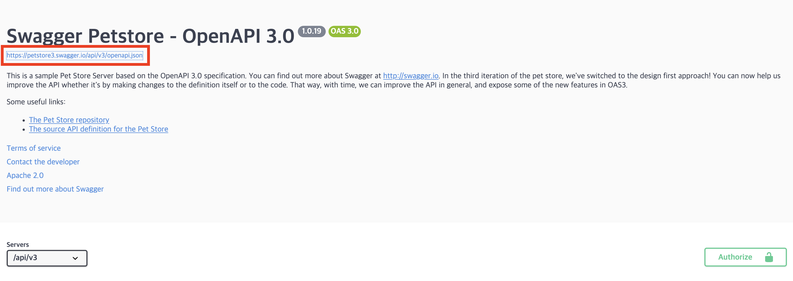
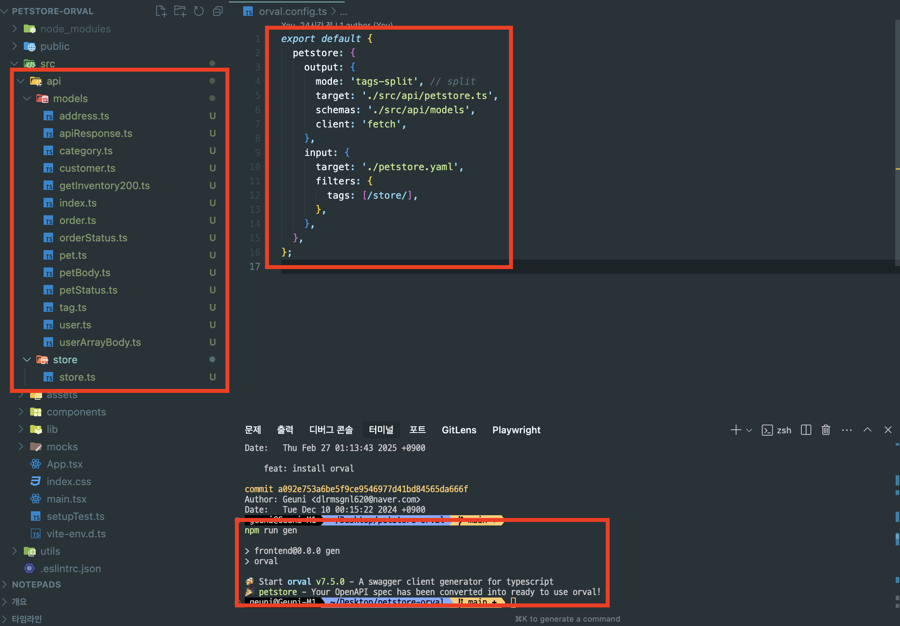
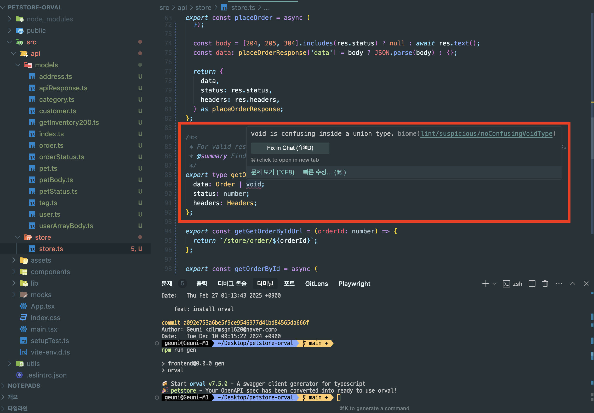
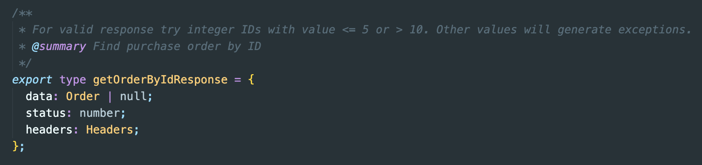

import { SideNote } from "@/components/layout";

우연히 단톡방에서 [Orval](https://orval.dev/)의 존재를 알게되었다.  
Orval의 존재를 알기 전에 [OAS generator](https://hmos.dev/how-to-use-oas-generator)에 대해서는 인지하고 있긴했지만, 이를 어떻게 구현할 수 있을지는 막막한 상태였다.
하지만 Orval의 존재를 알고난 뒤, '해볼만 하겠다'는 생각이 들었다.

회사에서 당장 사용할 순 없었다.
당시 프로덕트 노드 버전은 14.17.0버전이었고, orval은 최소 16이상이었던 걸로 기억한다

꼭 Orval만을 위해 노드버전을 올리자고 주장했던 것은 아니었지만, 최소 20버전이상 올리고 싶다고 팀장과의 면담이나, 회의 때 팀원에게 공유드리곤 했다.
그리고 작년 하반기를 기점으로 노드버전을 20.17.0 버전으로 올렸다.

현재 Orval을 진지하게 검토하고 있으며, 프로덕트에 반영하기 전에 내가 좀 더 디테일하게 사용해보고 싶어서 여러 테스트를 거쳐보려고 한다.

### Orval이란?

> Orval은 openAPI 명세를 기반으로 Typescript model을 자동 생성해주는 도구이다.

예를들어 새로운 API를 서버개발자가 만들어줬다. 그럼 나는 이 API의 타입을 입혀서 mockup 데이터를 생성하고, MSW를 통해 개발을 진행할 것이다.
여기서 세분화 시켜보면, 나의 작업공수는 다음과 같다.

- API 타입을 chatGPT에 붙여넣고 생성해달라고 한 뒤 복붙.
- mockup 데이터도 생성해달라고 한 뒤 복붙.
- MSW를 통해 API를 호출해보고 그려진 화면을 보며 오류는 없는지 확인.

하지만 개발을 하다보면 수정사항이 생긴다.
어느날 서버개발자가 수정사항이 생겼다고 해당 부분을 수정해달라고 요청했다.
나는 생성된 타입도 수정해야하고, mockup data도 수정하고, MSW를 통해 수정된 부분이 잘 반영되었는지 확인도 해야한다.
이 작업이 2~3번만 반복된다면 벌써부터 피곤하다.. 🥲

Orval을 사용한다면 이를 개선할 수 있을 것 같다.

---

### 사전 준비

먼저, Orval 공식문서에서 제공해주는 예제와 동일한 [petstore swagger](https://petstore3.swagger.io/#/pet/addPet)를 사용할 것이다.
baseURL을 등록해서 사용할 수도 있지만, 나의 경우는 json과 yaml파일로 각각 동일하게 만들어서 적용해봤다.

<SideNote>
  클릭해서 json으로 받거나,
  <br /> swagger editor를 통해 yaml로 변환했다
</SideNote>


### schema

먼저 type schema부터 만들어보자.

`orval.config.ts` 작성

```js
// orval.config.ts
import { defineConfig } from "orval";

export default defineConfig({
  petstore: {
    output: {
      mode: "tags-split", // 태그별로 분리
      target: "./src/api/petstore.ts", // 생성될 파일 경로
      schemas: "./src/api/models", // 생성될 모델 경로
      client: "fetch", // 사용할 클라이언트
    },
    input: {
      target: "./petstore.yaml", // 참고할 swagger 파일 경로
      filters: {
        tags: [/store/], // tag 필터 → "store"와 같이 string으로 작성하면 필터 안걸림.
      },
    },
  },
});
```

```bash
npx orval
```


명령어를 입력 후, Orval 파일이 생성된 것을 확인할 수 있다.  
filter를 반영해서 store만 생성되었다.

---

### transformer


생성된 model을 확인하다가 수정하고 싶은 부분이 생겼다.  
`void`가 아니라 `null`이나 `undefined`이었으면 좋겠다.

```js
// orval.config.ts
import { defineConfig } from "orval";
import type { GeneratorVerbOptions } from "@orval/core";

export default defineConfig({
  petstore: {
    output: {
      mode: "tags-split", // split
      target: "./src/api/petstore.ts",
      schemas: "./src/api/models",
      client: "fetch",
      override: {
        // here! 🙋‍♂️
        transformer: (verb: GeneratorVerbOptions): GeneratorVerbOptions => {
          if (verb.response?.definition) {
            const definition = verb.response.definition;
            console.log("definition", definition);
          }
          return verb;
        },
      },
    },
    input: {
      target: "./petstore.yaml",

      filters: {
        tags: [/store/],
      },
    },
  },
});
```


먼저 void가 뜨는 원인을 살펴보면, definition 에 content가 없을 경우 Orval에선 void로 정의한다.
이를 수정해서 schema를 생성하려면 transformer를 사용하면 된다.

```js {12-20}
// orval.config.ts
import type { GeneratorVerbOptions } from "@orval/core";
import { defineConfig } from "orval";

export default defineConfig({
  petstore: {
    output: {
      mode: "tags-split", // split
      target: "./src/api/petstore.ts",
      schemas: "./src/api/models",
      client: "fetch",
      override: {
        // here! 🙋‍♂️
        transformer: (verb: GeneratorVerbOptions): GeneratorVerbOptions => {
          if (verb.response?.definition.errors === "void") {
            verb.response.definition.errors = "null";
          }

          return verb;
        },
      },
    },
    input: {
      target: "./petstore.yaml",

      filters: {
        tags: [/store/],
      },
    },
  },
});
```



null로 잘 변경되었다.

---

### custom fetch

custom fetch를 사용하고 싶다면 `mutator`를 이용하면 된다.

```js {21-25}
// orval.config.ts
import type { GeneratorVerbOptions } from "@orval/core";
import { defineConfig } from "orval";

export default defineConfig({
  petstore: {
    output: {
      mode: "tags-split", // split
      target: "./src/api/petstore.ts",
      schemas: "./src/api/models",
      client: "fetch",
      override: {
        transformer: (verb: GeneratorVerbOptions): GeneratorVerbOptions => {
          if (verb.response?.definition.errors === "void") {
            verb.response.definition.errors = "null";
          }

          return verb;
        },

        // here! 🙋‍♂️
        mutator: {
          path: "./src/api/http-client.ts",
          name: "customFetch",
        },
      },
    },
    input: {
      target: "./petstore.yaml",

      filters: {
        tags: [/store/],
      },
    },
  },
});
```

참고로 mutator의 **name은 해당 경로에 포함된 함수의 명칭과 일치**해야한다.
[공식문서](https://github.com/orval-labs/orval/blob/master/samples/next-app-with-fetch/custom-fetch.ts)에서 제공하는 방법대로 반영했을 때 customFetch를 생성할 수있다.

하지만 나의 경우엔, httpClient를 다른 방법으로 사용하고 있다. 🥲
따로 제공해주는 방법은 없는 듯하고, wrapper를 하나 두어서 이를 해결할 수 있다.

```js
// http-client.ts
import { createUrl } from "./create-url";

export const httpClient = {
  get: async ({ url, options }: GetRequest): Promise<Response> => {
    const resolvedUrl = createUrl(url);
    const token = localStorage.getItem("AccessToken");
    const headers = {
      ...(options?.headers || {}),
      ...(token ? { Authorization: `Bearer ${token}` } : {}),
    };

    const response = await fetch(resolvedUrl, {
      ...options,
      method: "GET",
      headers,
    });

    return await checkResponse(response);
  },
  // ..
};
```

```js
// customHttpClient.ts
type HttpMethod = 'GET' | 'POST' | 'PUT' | 'PATCH' | 'DELETE';

export const customHttpClient = async <T>(
  url: string,
  options: RequestInit & { method: HttpMethod },
): Promise<T> => {
  const { method, body, ...restOptions } = options;
  const lowerMethod = method.toLowerCase() as Lowercase<HttpMethod>;

  const args =
    body !== undefined
      ? { url, body, options: restOptions }
      : { url, options: restOptions };

  return httpClient[lowerMethod](args).then(async (response) => {
    const status = response.status;

    const text = [204, 205, 304].includes(status)
      ? null
      : await response.text();

    const data: T = text ? JSON.parse(text) : ({} as T);
    return data;
  });
};
```

---

###
