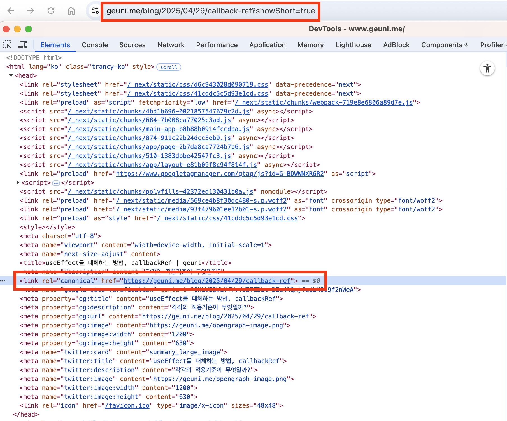

구글에서 내 블로그에 콘텐츠를 잘 가져갈 수 있도록, Google Search Console에 [색인을 등록](https://geuni620.github.io/blog/2023/8/6/google-search-console/)했었다.


하지만 색인이 생성되지 않았다. **적절한 표준 태그가 포함된 대체페이지**를 확인해보면 다음과 같은 화면이 노출된다.


[prevent-layout-shift](https://www.geuni.me/blog/2025/03/22/prevent-layout-shift)는 색인이 잘 생성되어있는 상태인데, 왜 위와 같은 이미지 리스트에 포함되는걸까?

---

## 문제상황

현재 이 블로그에는 글을 두 가지 형태로 노출시키고 있다.  
하나는 일반 글이고, 다른 하나는 짧은 글이다.

짧은 글은 리스트에서 체크박스를 체크했을 때 노출되는데, 이때 URL에 쿼리파라미터가 붙는다.  
이는 boolean 타입으로 URL에 자동으로 생성되며, 페이지 이동시 계속 남아있게 된다.

이것 때문에 위와 같은 **적절한 표준 태그가 포함된 대체페이지**에 색인이 생성된 페이지의 리스트가 포함되는 것이다.

즉 한 마디로, 쿼리 파라미터가 붙은 동일 콘텐츠 페이지들이 중복페이지로 인식되며, 이는 SEO에 부정적인 영향을 줄 수 있다.

> Google에서 동일한 콘텐츠가 포함된 여러 URL을 발견하면 중복된 것으로 간주하여 검색 결과에서 해당 URL의 순위를 낮출 수 있습니다.
> — [Next.js 공식 문서](https://nextjs.org/learn/seo/canonical)

---

## 해결방법

이를 해결하기 위해 `canonical`태그를 추가해주면 된다.  
canonical 태그는 보통 `<head>` 안에 명시하며, Next.js에서는 아래와 같이 설정할 수 있다.

```ts
export const metadata = {
  alternates: {
    canonical: "current url",
  },
};
```

또는,

```ts
export const generateMetadata = async ({
  params,
}: {
  params: Promise<{ slug: string[] }>;
}) => {
  //...
  return {
    //...
    alternates: {
      canonical: "current url",
    },
  };
};
```

등록 후엔 `<head>` 안에 canonical link가 포함된다.



<br />

> update: 2025-05-19  
> canonical 태그가 업데이트 되었다.  
> 기존에 작성했던 [prevent-layout-shift](https://www.geuni.me/blog/2025/05/07/blog-seo?showShort=true)는 '대체페이지' 문제가 해결되었다.
> 아래 이미지에 보이는 root페이지는 새롭게 등록 후 유효성 검사를 진행해놓은 상태다.  
> 깜빡하고 blog url을 "/"로만 작성했더니 발생한 문제로 보인다.


---

### 참고자료

[SEO의 핵심, 표준 URL이란 무엇인가?](https://osoma.kr/blog/canonical-url/)  
[Google 검색센터: rel="canonical" 및 다른 메서드로 표준 URL을 지정하는 방법](https://developers.google.com/search/docs/crawling-indexing/consolidate-duplicate-urls?hl=ko)  
[Next.js 공식문서: What are Canonical Tags?](https://nextjs.org/learn/seo/canonical)
