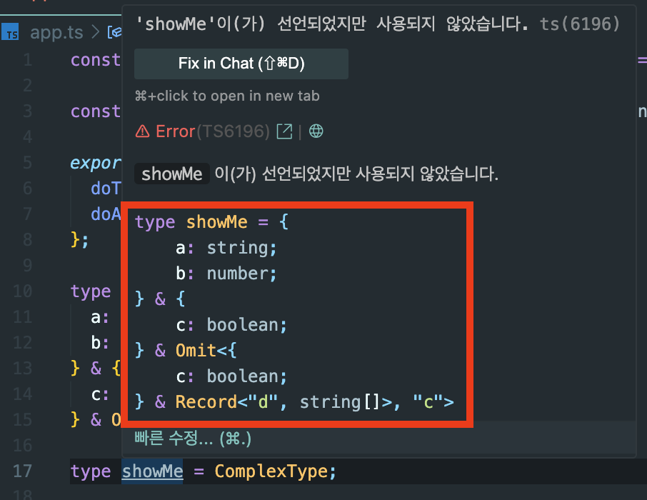

## Prettify 타입

예를들어 이런 타입이 있다.

```ts
type ComplexType = {
  a: string;
  b: number;
} & {
  c: boolean;
} & Omit<{ c: boolean } & Record<"d", string[]>, "c">;

type showMe = ComplexType;
```

위와 같은 타입을 호버했을 시, 다음과 같은 결과를 출력한다.



사실 이 타입의 의도는 다음과 같다.

```ts
type ComplexType = {
  a: string;
  b: number;
  c: boolean;
  d: string[];
};
```

hover(이하 호버) 했을 때 위와 같이 출력해주도록 만드는 유틸리티 타입이 바로 Prettify이다.

```ts
// prettify
type Prettify<T> = {
  [K in keyof T]: T[K];
} & {};

type showMe = Prettify<ComplexType>;
```

위 타입의 결과는 아래와 같다.


---

## 왜 & &#123; &#125;를 붙여주는걸까?

한 가지 의문이 생겼다.

```ts
type Prettify<T> = {
  [K in keyof T]: T[K];
}; // & { }
```

마지막에 & 연산자와 함께 빈 객체를 생성하는데, 이를 제거해도 동일한 결과를 출력했다.  
그럼 왜 `& {}`를 붙여주는걸까?

[Intersection with object in Prettify helper type?](https://stackoverflow.com/questions/78453542/intersection-with-object-in-prettify-helper-type)  
해당 질문에 대한 답변으로 힌트를 얻었다.

```ts
namespace A {
  type PrettifyRemoveIntersection<T> = {
    [K in keyof T]: T[K];
  };

  type Z = PrettifyRemoveIntersection<ComplexType>;
  // type Z = { a: string; b: number; c: boolean; d: string[]; }

  type ZZ = Array<PrettifyRemoveIntersection<{ a: string }>>;
  // ✅ type ZZ = PrettifyRemoveIntersection<{ a: string }>[]
}

namespace B {
  type PrettifyAndEmptyObject<T> = {
    [K in keyof T]: T[K];
  } & {};

  type Z = PrettifyAndEmptyObject<ComplexType>;
  // type Z = { a: string; b: number; c: boolean; d: string[]; }

  type ZZ = Array<PrettifyAndEmptyObject<{ a: string }>>;
  // ✅ type ZZ = { a: string }[]
}
```

✅ 부분을 살펴보면, 차이점이 존재한다.  
즉 `& {}`를 붙여주는 것이 중요한 이유는 시각적 평탄화 효과를 주기 때문이다.  
그럼 또 궁금하다. 뭐가 달라졌길래 다르게 출력되는걸까?

---

## 지연평가

해당 부분에 대해서 문서화 되어있거나, 공식적으로 언급된 사례는 없는 듯하다.

[6 TypeScript tips to turn you into a WIZARD](https://youtu.be/lraHlXpuhKs?si=2REPzVd1X4hlEyc_)  
우연히 위 영상의 댓글을 읽다가 해당 부분에 대한 힌트를 얻었다.

> TypeScript typically uses lazy type evaluation, meaning it keeps the crazy nested structure of your types until it has to evaluate a value against them.  
> 타입스크립트는 일반적으로 [`지연평가`](https://inpa.tistory.com/entry/LODASH-%F0%9F%93%9A-%EC%A7%80%EC%97%B0-%ED%8F%89%EA%B0%80-%EC%9B%90%EB%A6%AC-lodash%EB%8A%94-%EC%98%A4%ED%9E%88%EB%A0%A4-%EC%84%B1%EB%8A%A5%EC%9D%B4-%EC%A2%8B%EC%9D%84-%EC%88%98-%EC%9E%88%EB%8B%A4)를 사용합니다. 이는 타입스크립트가 실제 값과 타입을 비교해야할 때까지, 복잡하고 중첩된 타입 구조를 그대로 유지한다는 의미입니다.

> It has certain heuristics to simplify computation, where it will sometimes evaluate things eagerly to save it work later.  
> 타입스크립트는 계산을 단순화하기 위한 특정 휴리스틱을 가지고 있어서, 때로는 후속으로 더 많은 작업을 피하기 위해 일부 타입을 미리 평가하기도 합니다.

> One of those heuristics is specifically when you construct a new explicit mapped type with a constraint, it will attempt to evaluate that in-place to resolve the constraint eagerly.  
> 이러한 휴리스틱 중 하나는, 새로운 명시적 매핑 타입을 제약 조건과 함께 생성할 때, 컴파일러가 해당 제약 조건을 즉시 평가하려 시도한다는 점입니다.

> The `& {}` is doing the work as the constraint here.
> `& {}`는 여기서 제약 조건으로 작용합니다.

즉 `PrettifyRemoveIntersection`를 사용했을 때 지연평가로 인해 계산된 타입이 노출되지 않았던 것이다. 그리고 `PrettifyAndEmptyObject`를 사용했을 땐, 제약조건인 `& {}`가 있어 계산된 타입이 노출되는 것이다.

한편으로 지연평가를 사용하는 이유가 성능을 더 좋게 만들기 위함인데, 이 옵션을 꺼버리는 안 좋은 효과이기도 한 것이다.  
적절히 필요하다고 판단되면 사용하되, 복잡도가 높다면 오히려 쓰지 않고 새롭게 타입을 생성하는 것이 더 나은 방법이라고 생각된다.

---

## 참고자료

[The `Prettify` Helper](https://www.totaltypescript.com/concepts/the-prettify-helper)  
[6 TypeScript tips to turn you into a WIZARD](https://youtu.be/lraHlXpuhKs?si=v1jHZVR-9GdkO9Sq)  
[Intersection with object in Prettify helper type?](https://stackoverflow.com/questions/78453542/intersection-with-object-in-prettify-helper-type)  
[Lodash 지연 평가(Lazy Evaluation) 원리](https://inpa.tistory.com/entry/LODASH-%F0%9F%93%9A-%EC%A7%80%EC%97%B0-%ED%8F%89%EA%B0%80-%EC%9B%90%EB%A6%AC-lodash%EB%8A%94-%EC%98%A4%ED%9E%88%EB%A0%A4-%EC%84%B1%EB%8A%A5%EC%9D%B4-%EC%A2%8B%EC%9D%84-%EC%88%98-%EC%9E%88%EB%8B%A4)
