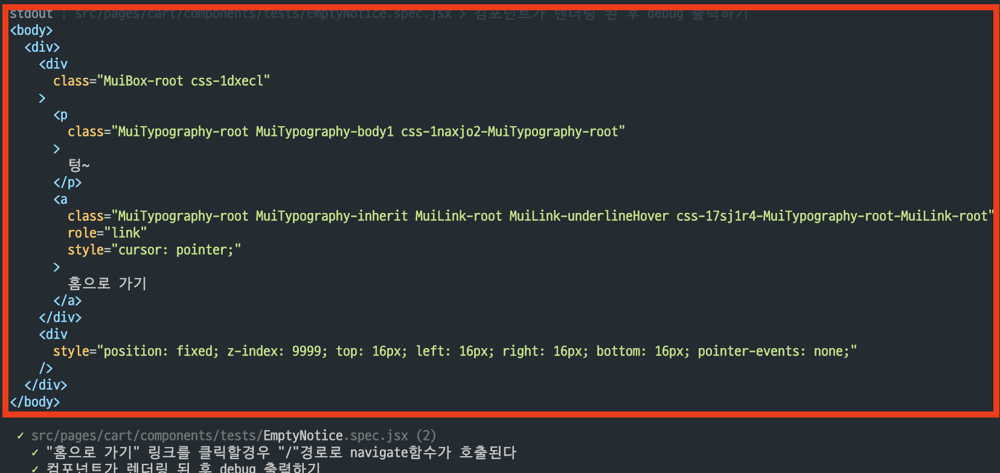
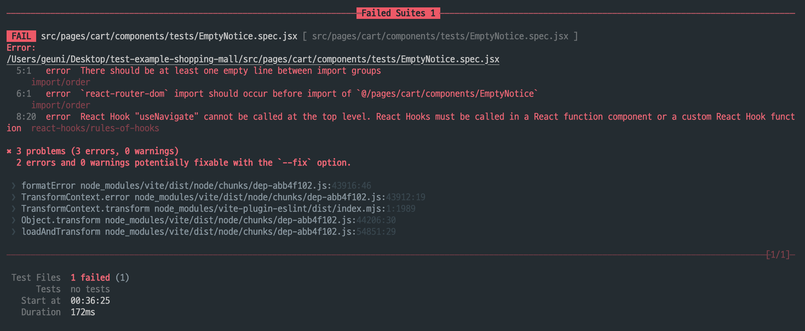

## 테스트 환경에서 로그 출력하기

```jsx
it("컴포넌트가 렌더링 된 후 debug 출력하기", async () => {
  await render(<EmptyNotice />);

  // DOM 구조 출력
  screen.debug();
});
```

`jsdom`에 컴포넌트가 어떻게 렌더링 되는지 확인할 수 있음



---

## 의존성 패키지 모킹하기

다음과 같은 컴포넌트가 있다.

```jsx
import { useNavigate } from "react-router-dom";

const EmptyNotice = () => {
  // here!!! 🙋‍♂️
  const navigate = useNavigate();
  const handleClickBack = () => {
    navigate("/");
  };

  return (
   //..
  );
};
```

해당 컴포넌트는 `react-router-dom` 패키지에 의존하고 있다.

```jsx
import { useNavigate } from "react-router-dom";

const navigateFn = useNavigate();

it('"홈으로 가기" 링크를 클릭할경우 "/"경로로 navigate 함수가 호출된다', async () => {
  const { user } = await render(<EmptyNotice />);

  await user.click(screen.getByText("홈으로 가기"));
  expect(navigateFn).toHaveBeenCalledWith("/");
});
```

위 테스트코드를 그대로 실행하면 실패한다.  
`useNavigate` 훅이 `Router context` 없이 동작하지 않기 때문이다.



이를 해결하기 위해서 `navigate` 함수를 모킹해야한다.

```jsx
// 실제 모듈을 모킹한 모듈로 대체하여 테스트 진행
// useNavigate 훅으로 반환받은 navigate 함수가 올바르게 호출되었는가? → 스파이 함수
const navigateFn = vi.fn();

vi.mock("react-router-dom", async () => {
  const original = await vi.importActual("react-router-dom");

  return { ...original, useNavigate: () => navigateFn };
});

it('"홈으로 가기" 링크를 클릭할경우 "/"경로로 navigate함수가 호출된다', async () => {
  const { user } = await render(<EmptyNotice />);

  await user.click(screen.getByText("홈으로 가기"));
  expect(navigateFn).toHaveBeenNthCalledWith(1, "/");
});
```

[vi.mock](https://vitest.dev/api/vi.html#vi-mock)은 모듈을 부분적으로 또는 전체적으로 모킹할 수 있게 해준다.  
[vi.importActual](https://vitest.dev/api/vi.html#vi-importactual)는 실제 모듈을 그대로 가져온다.

즉, react-router-dom 패키지를 모킹한 뒤, useNavigate를 navigateFn 함수로 대체한다.

여기서 navigateFn은 spy(이하 스파이) 함수이다. 스파이 함수란 특정 함수의 호출 여부/인자 등을 추적 가능하게 해주는 함수이다.

---

## setup, teardown 함수

---

## useCustomHook 테스트 코드 작성하기

다음과 같은 훅(hooks)이 있다.  
일반적으로 모달을 열고, 닫을 때 사용하는 훅이다.

```jsx
import { useState } from "react";

const useConfirmModal = (initialValue = false) => {
  const [isModalOpened, setIsModalOpened] = useState(initialValue);

  const toggleIsModalOpened = () => {
    setIsModalOpened(!isModalOpened);
  };

  return {
    toggleIsModalOpened,
    isModalOpened,
  };
};
```

이 훅의 테스트 코드를 작성해보자.

```jsx
import { renderHook, act } from "@testing-library/react";
import useConfirmModal from "./useConfirmModal";

it("호출 시 initialValue 인자를 지정하지 않는 경우 isModalOpened 상태가 false로 설정된다.", () => {
  // result: 훅을 호출하여 얻은 결과 값을 반환 → result.current 값의 참조를 통해 최신 상태를 추적할 수 있다.
  // rerender: 훅을 원하는 인자와 함께 새로 호출하여 상태를 갱신한다.
  const { result } = renderHook(useConfirmModal);

  expect(result.current.isModalOpened).toBe(false);
});

it("호출 시 initialValue 인자를 boolean 값으로 지정하는 경우 해당 값으로 isModalOpened 상태가 설정된다.", () => {
  const { result } = renderHook(() => useConfirmModal(true));

  expect(result.current.isModalOpened).toBe(true);
});

it("훅의 toggleIsModalOpened()를 호출하면 isModalOpened 상태가 toggle된다.", () => {
  const { result } = renderHook(useConfirmModal);

  act(() => result.current.toggleIsModalOpened());

  expect(result.current.isModalOpened).toBe(true);
});
```

[`renderHook`](https://testing-library.com/docs/react-testing-library/api#renderhook)함수와, [`act`](https://testing-library.com/docs/react-testing-library/api#act)함수가 눈에 띈다. 각각 어떤 역할을 하는걸까?

<br />

`renderHook` 함수는 훅을 테스트 환경에서 렌더링 할 수 있다.

```jsx
const { result, rerender } = renderHook(useConfirmModal);
```

`renderHook`함수는 result와 rerender를 반환하는데, result의 current 값을 통해 훅의 상태를 추적할 수 있다.

```jsx
const { result } = renderHook(useConfirmModal);

console.log(result.current); // { isModalOpened: false }

expect(result.current.isModalOpened).toBe(false);
```

<br />

`act`함수는 훅의 상태를 갱신할 수 있다.  
참고로 `act`함수는 `testing-library/react`패키지에서 제공해주기도 하지만, [react 패키지](https://react.dev/reference/react/act)에서도 제공해주고 있다.

> react에서 제공해주는 act를 사용할 시, 써야할 코드가 많아질 수 있어서, testing-library에서 제공해주는 act를 사용하는 것을 권장한다.

```jsx
// default false
const { result } = renderHook(useConfirmModal);

// 훅의 상태를 갱신
// act로 감싸지 않는다면, 훅의 상태가 갱신되지 않는다.
act(() => result.current.toggleIsModalOpened());

// 훅의 상태가 갱신되었는지 확인
expect(result.current.isModalOpened).toBe(true);
```

---

## 타이머테스트

debounce 함수를 테스트해보자.

```jsx
export const debounce = (fn, wait) => {
  let timeout = null;

  return (...args) => {
    const later = () => {
      timeout = -1;
      fn(...args);
    };

    if (timeout) {
      clearTimeout(timeout);
    }
    timeout = window.setTimeout(later, wait);
  };
};
```

```jsx
it("특정 시간이 지난 후 함수가 호출된다.", () => {
  const spy = vi.fn();
  const deboundedFn = debounce(spy, 300);

  deboundedFn();

  expect(spy).toHaveBeenCalled();
});
```

위와 같이 테스트를 실행하면 테스트는 실패한다.

테스트 코드는 비동기 타이머와 무관하게 동기적으로 실행되며, 비동기 함수가 실행되기 전에 단언이 실행되어 테스트는 실패한다.

이를 해결하기 위해, vitest에서는 타이머를 모킹할 수 있는 API를 제공한다.

- [vi.useFakeTimers](https://vitest.dev/api/vi.html#vi-usefaketimers)

useFakeTimers를 사용하면, 테스트코드가 작성하는 시점에 타이머를 모킹할 수 있다.

```jsx
beforeEach(() => {
  // 테스트 전 타이머 모킹
  vi.useFakeTimers();
});

afterEach(() => {
  // 테스트 후 타이머 초기화
  vi.useRealTimers();
});

it("특정 시간이 지난 후 함수가 호출된다.", () => {
  vi.useFakeTimers();

  const spy = vi.fn();
  const deboundedFn = debounce(spy, 300);

  deboundedFn();

  // 0.3s 후  함수가 호출된다.
  vi.advanceTimersByTime(300);
  expect(spy).toHaveBeenCalled();
});
```

만약 특정 시간을 조작해야한다면, [vi.setSystemTime](https://vitest.dev/api/vi.html#vi-setsystemtime)을 사용하면 된다.

```jsx
it("2023년 12월 25일 기준, ...", () => {
  vi.useFakeTimers();
  // 특정 시간을 조작, 2023년 12월 25일
  vi.setSystemTime(new Date("2023-12-25"));
  //...
});
```

추가로 해당 스코프 내 테스트가 실행되고 난 뒤, 다른 테스트환경에 영향을 주지 않도록 하기 위해 teardown 함수를 이용해 타이머 설정을 초기화 시켜줘야한다.

```jsx
afterEach(() => {
  // 테스트 후 타이머 초기화
  vi.useRealTimers();
});
```

---

## userEvent vs fireEvent

---

<br />

## 참고자료

[vitest discussions #5809: Mocking imported modules correctly with Vitest and React](https://github.com/vitest-dev/vitest/discussions/5809)
