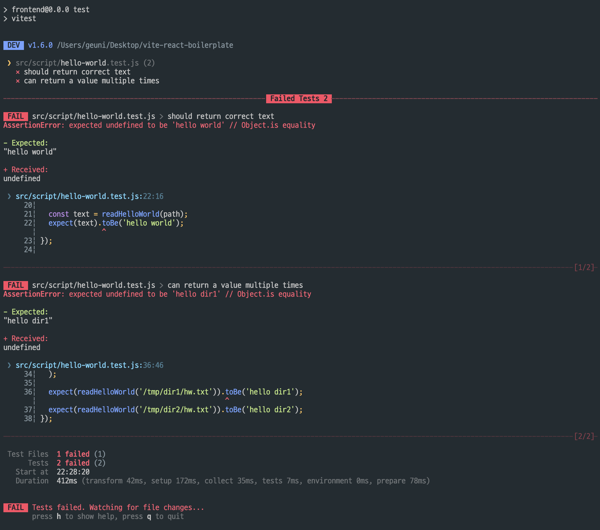

> 파일시스템의 유닛테스트는 어떻게 작성할 수 있을까?

## 예시

[vitest기준으로 공식문서](https://vitest.dev/guide/mocking.html#file-system)에서는 다음과 같이 소스코드를 제공해준다.  
하지만 **테스트코드를 실행해보면 에러가 발생**한다.

```js
// real-hello-world.js
import { readFileSync } from "node:fs";

export function readHelloWorld(path) {
  return readFileSync(path, "utf-8");
}
```

```js
// hello-world.test.js
import { beforeEach, expect, it, vi } from "vitest";
import { fs, vol } from "memfs";
import { readHelloWorld } from "./read-hello-world.js";

// tell vitest to use fs mock from __mocks__ folder
// this can be done in a setup file if fs should always be mocked
vi.mock("node:fs");
vi.mock("node:fs/promises");

beforeEach(() => {
  // reset the state of in-memory fs
  vol.reset();
});

it("should return correct text", () => {
  const path = "/hello-world.txt";
  fs.writeFileSync(path, "hello world");

  const text = readHelloWorld(path);
  expect(text).toBe("hello world");
});

it("can return a value multiple times", () => {
  // you can use vol.fromJSON to define several files
  vol.fromJSON(
    {
      "./dir1/hw.txt": "hello dir1",
      "./dir2/hw.txt": "hello dir2",
    },
    // default cwd
    "/tmp"
  );

  expect(readHelloWorld("/tmp/dir1/hw.txt")).toBe("hello dir1");
  expect(readHelloWorld("/tmp/dir2/hw.txt")).toBe("hello dir2");
});
```



---

에러를 해결하기 위해 내게 효과가 있었던 [방법](https://github.com/tschaub/mock-fs/issues/384#issuecomment-2173802850)은 아래와 같다.

```js
vi.mock("node:fs", async () => {
  const memfs = await vi.importActual("memfs");

  return {
    default: memfs.fs,
    ...memfs.fs,
  };
});
```

이 방법은 [react-router-dom을 모킹할 때 방법과 동일하다.](https://www.geuni.me/blog/2025/06/04/unit-test#%EC%9D%98%EC%A1%B4%EC%84%B1-%EB%AA%A8%ED%82%B9)

---

## memfs

위 코드에서 다시 확인해보면 `memfs`가 보인다. 이게 뭘까?  
노드에서 fs는 import 종류가 다양하다.

```js
import fs from "fs"; // Node.js 기본 파일시스템 모듈 (동기/콜백 방식)
import fs from "node:fs"; // 위와 동일하지만 Node.js 내장 모듈임을 명시 (권장)
import fsPromise from "fs/promises"; // Promise 기반 비동기 파일시스템 (async/await 사용)
import { fs } from "memfs"; // 메모리 기반 가상 파일시스템 (테스트용, 실제 파일 생성 안함)
```

memfs는 파일시스템을 테스트하기 위해 제공하는 [라이브러리](https://github.com/streamich/memfs)이다.  
파일시스템을 테스트하기 위해선 실제 파일에 영향이 간다.

예를들어 파일을 읽은 후 파일의 내용을 수정한다고 가정했을 때, 테스트코드를 실행할 때마다 실 개발환경에 영향을 주는 것이다.

이 문제를 해결하기 위해 `memfs`를 사용한다.  
즉 격리된 테스트환경을 제공해주는 라이브러리이다.

---

## 참고자료

[vitest docs: file-system](https://vitest.dev/guide/mocking.html#file-system)  
[github: memfs](https://github.com/streamich/memfs)  
[#384 mock-fs issue:mock-fs to memfs](https://github.com/tschaub/mock-fs/issues/384#issuecomment-2173802850)
