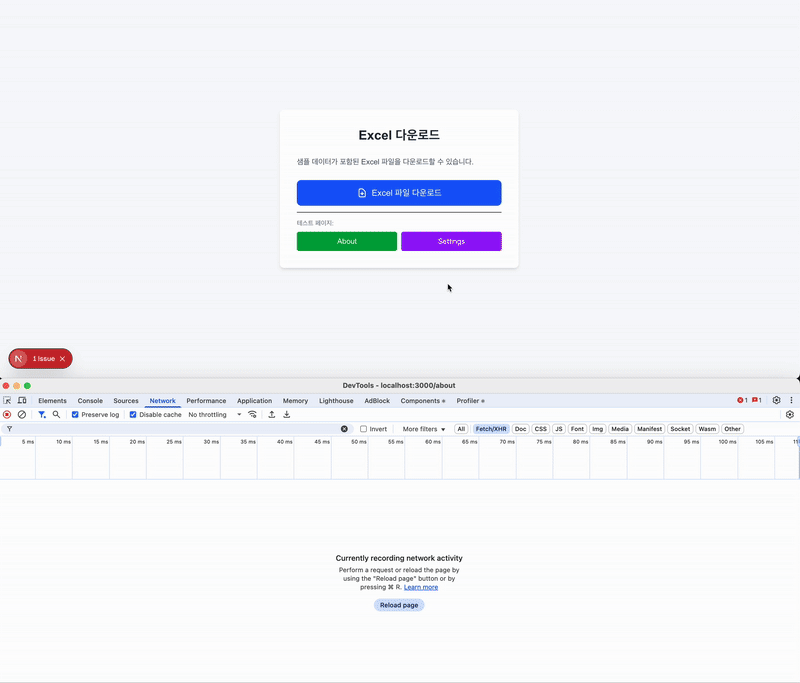
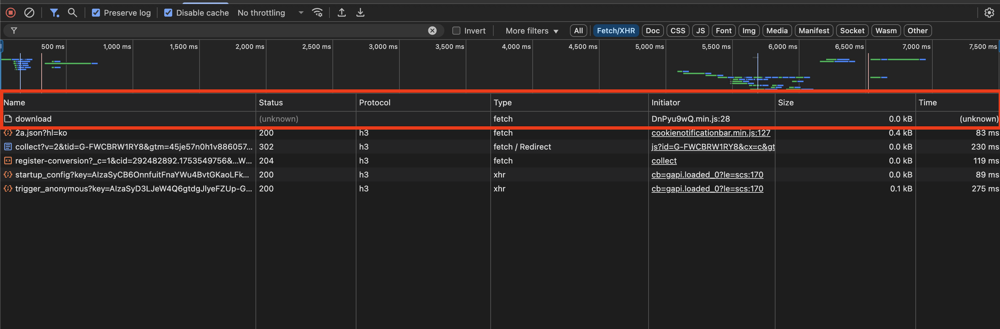
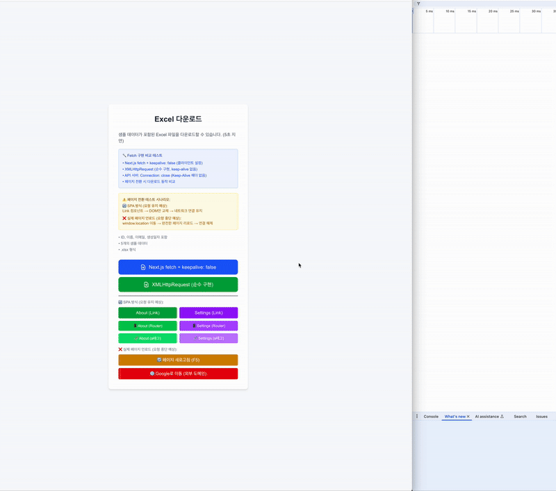
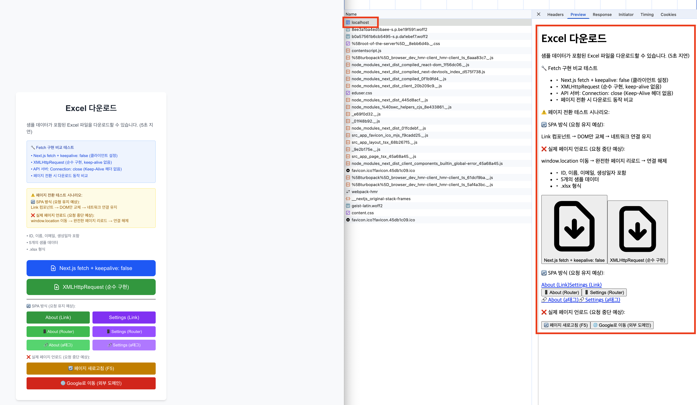
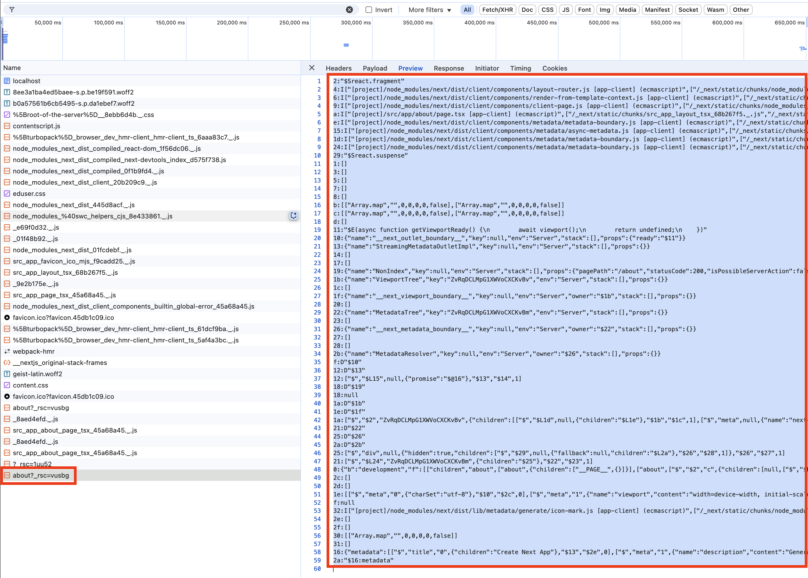

> 예시 코드는 [여기서](https://github.com/Geuni620/download-excel-test) 확인할 수 있어요.

A페이지에서 보여지는 데이터를 엑셀로 다운받으려 할 때, 서버에서 처리시간이 길어져 사용자가 이를 기다리지 못하고 B페이지를 이탈했다고 가정해보자.  
B페이지에서 조회된 데이터를 확인하고 있는데, 요청보냈던 A페이지의 응답이 도착해서 엑셀파일을 브라우저를 통해 다운받을 수 있을까?

## 예시만들기

### Case 1

Next.js를 이용해서 간단한 예시를 만들어봤다.  
테스트는 다음과 같이 진행했다.

1. index페이지에서 'Excel 파일 다운로드 버튼 클릭'
   - 이때 응답은 최소 5초 이후에 받도록 setTimeout을 적용했다.
2. About 버튼을 클릭해서 About 페이지로 이동
   - 5초 전에 페이지를 이동시켰다.
3. 이동한 페이지에서 대기



페이지를 이탈하더라도 response에 대한 응답이 도착하며, 다운로드가 가능한 것을 확인할 수 있다.

### Case 2

위 예시는 **같은 도메인이 유지**되었을 때의 경우다.  
만약, A페이지에서 B페이지로 이동할 때, B페이지가 다른 도메인이라면 어떻게 될까?

1. index페이지에서 'Excel 파일 다운로드 버튼 클릭'
2. Gmail로 도메인이 다른 페이지로 이동
3. 이동한 페이지에서 대기



개발자도구를 확인했을 때, `unknown`이 떠버린다.

### Case 3

만약 '새로고침(reload)' 시켰다면 어떻게 될까?

1. index페이지에서 'Excel 파일 다운로드 버튼 클릭'
2. 페이지 새로고침
3. 대기


개발자도구를 확인했을 때, `canceled`가 떠버린다.

---

## 고민하기

`Case 2`는 어찌보면 다운로드 실패하는게 당연하다.  
도메인 변경시, 브라우저가 이미 해당 요청을 취소했고, 응답을 받을 페이지가 더이상 존재하지 않는다.

`Case 3`도 새로고침으로 인해, 브라우저의 모든 실행요청을 중단시키는 것이다.

문제는 `Case 1`인데, `Case 3`에서 한 가지 힌트를 얻었다.
`Case 3`의 로직을 구현하기 위해, `window.location.reload()`함수를 사용하였다.

그럼, `window.location.href`를 사용해서 페이지를 이동할 경우에도, 다운로드는 유지될까?  
확인해보자.



1. index페이지에서 'Excel 파일 다운로드 버튼 클릭'
   - 이때 응답은 최소 5초 이후에 받도록 setTimeout을 적용했다.
2. About 버튼을 클릭해서 About 페이지로 이동
   - 최소 5초 전에 페이지를 이동시켰다.
3. 이동한 페이지에서 대기

첫 번째로 시도한 건 Link 태그를 사용한 로직이다. 위에서 확인했듯이 페이지를 이동해도 다운로드가 가능하다.

```jsx
<Link
  href="/about"
  className="flex-1 bg-green-600 hover:bg-green-700 text-white font-medium py-2 px-3 rounded text-center text-sm transition-colors duration-200"
>
  About (Link)
</Link>
```

두 번째로 시도한 a 태그를 사용한 로직이다. 영상에서 볼 수 있듯이, 페이지를 이동하면 다운로드를 실패한다.

네트워크 탭에서 `canceled`가 뜨는 것을 확인할 수 있었다.

```jsx
<a
  href="/about"
  className="flex-1 bg-green-400 hover:bg-green-500 text-white font-medium py-2 px-3 rounded text-center text-xs transition-colors duration-200"
>
  🔗 About (a태그)
</a>
```

---

## 원인분석

### 다운로드

React는 **SPA 방식**으로 동작한다.  
React-Router와 같은 라우팅 라이브러리를 사용할 경우, 사용자는 URL 변경과 함께 화면도 전환되는 것처럼 보인다.

하지만, **브라우저 입장에서는 페이지 전환이 발생하지 않는다.**  
단지, 기존의 JS 런타임 컨텍스트 내에서 DOM을 조작하는 것일 뿐이다.

즉, 페이지의 `unload`이벤트가 발생하지 않기 때문에, `fetch` 또는 `Blob` 기반의 다운로드 요청도 정상적으로 유지된다.

반면, `a`태그로 다른 URL을 이동하는 경우에는 **브라우저 수준의 페이지 전환이 발생**한다.  
이 경우 브라우저는 기존 페이지를 `unload`하고, JS 실행 컨텍스트와 네트워크 요청을 모두 중단시킨다.

그래서 다운로드가 중단되거나 실패할 수 있었던 것이다.

### Next.js의 SPA

위 전제는 어디까지는 **SPA**라는 가정에서 시작되었다.

> **그럼 Next.js는 SPA가 맞나?**

`use client`가 명시된 클라이언트 컴포넌트는 **CSR**일까? **SSR**일까?

하나씩 짚어보자.



처음 페이지를 띄우고 난 뒤 네트워크 탭을 열었을 때, `localhost`가 보인다.  
이를 눌러서 preview를 확인해보면 Style과 Javascript가 반영되지 않은 HTML, 즉 SSR인 것을 알 수 있다.

참고로 root페이지부터 `use client`를 기입해 서버 컴포넌트가 아닌 클라이언트 컴포넌트로 테스트를 진행했다.

### Next.js의 Link

그럼 Link 컴포넌트로 통해 페이지를 이동했을 땐 어떻게 동작할까?  
SPA로 동작할 것이라고 예상했다.

그래서 개발자도구의 네트워크에 js파일이 찍힐 것이라 예상했는데, `about?_rsc=vusbg`가 찍혔다. about은 about페이지로 이동했으니 붙었다고 생각했는데, `?_rsc=vusbg`는 뭘까?



Next.js 공식문서에서 [React Server Component Payload (RSC)](https://nextjs.org/docs/app/getting-started/server-and-client-components?utm_source=chatgpt.com#how-do-server-and-client-components-work-in-nextjs)라는 키워드를 발견했다.  
공식문서를 참고해보면, React Server Component payload는

- 서버에서 렌더링된 **React 컴포넌트 트리 정보를 직렬화한 데이터**
- 클라이언트에서 React가 이 데이터를 받아서 다시 **DOM으로 렌더링**
- Payload에 포함된 내용은 아래와 같다.
  - 페이지/레이아웃에 포함된 Server Components의 렌더결과
  - Server Components에서 Client Components로 전달되는 props 요소
  - Client Component placeholder 및 JS 참조

참고로 \*`vusbg`는 내부적으로 hydration 및 캐시를 위한 키이다.

즉 client components에서 React server components payload를 전달받고, **JS가 로드되는 SPA로 동작**한다.

---

## 결론

SPA 방식에서는 다운로드 요청이 유지된다. 반면, 브라우저 수준의 페이지 전환이 발생하면 요청은 중단된다. 이는 `a`태그나 `window.location.href` 등을 통해 페이지를 이동했을 때 발생한다.

Next.js에 `use client`가 선언된 클라이언트 컴포넌트 초기에 SSR로 렌더링되지만, 이후 `Link`컴포넌트나 `useRouter().push()`등을 통해 페이지를 이동하면 SPA처럼 동작한다. 이 경우에도 다운로드 요청은 유지된다.

---

## 참고자료

[Reliably Send an HTTP Request as a User Leaves a Page](https://css-tricks.com/send-an-http-request-on-page-exit/)  
[Request: keepalive property](https://developer.mozilla.org/en-US/docs/Web/API/Request/keepalive)  
['use client'가 CSR이라고 알고 있는 거 아니죠? Next.js 면접질문 정복](https://velog.io/@k-svelte-master/nextjs-rsc-csr-ssr)  
[Nextjs 페이지 컴포넌트(page.tsx)에서 'use client'를 선언하면 어떻게 렌더링할까?](https://youtu.be/9wiLf2t0Goc?si=KMs8wjRyGiQ2ochA)  
[Next.js docs: Server and Client Components](https://nextjs.org/docs/app/getting-started/server-and-client-components)
