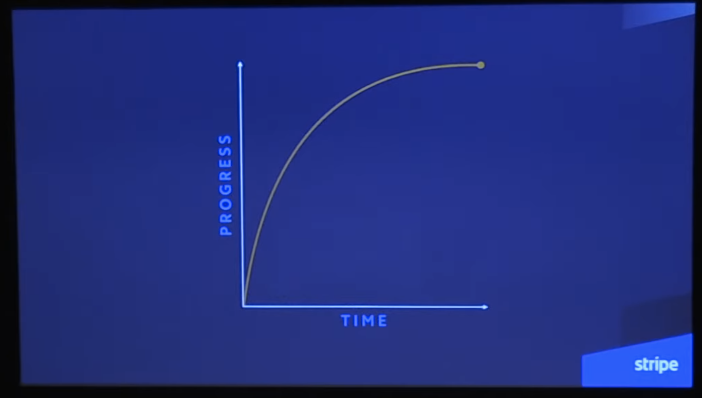

[Great Animations](https://emilkowal.ski/ui/great-animations)

- ease-out(빠르게 시작하고 마지막에 느려지는), 300ms 이하로 설정
- 키보드 단축키에는 애니메이션을 넣지 않는 게 좋음

### 퍼포먼스

- 60FPS 유지가 최우선
- transform, opacity만 애니메이션에 사용하는 것이 이상적이다.
- 이 속성들은 Composite 단계만 트리거하여 브라우저 작업을 최소화 함
- 반면, margin, padding 등은 Layout -> Paint -> Composite 모두 트리거함

 

- 하드웨어 가속 애니메이션 사용
  - CSS 애니메이션 또는 Web Animation API를 사용하면 메인 스레드가 바쁘더라도 애니메이션은 부드럽게 유지
  - 단, CSS 애니메이션이라고 해도 모든 속성이 하드웨어 가속을 받는 것은 아님 -> transform, opacity는 안전한 선택
- rAF 기반 라이브러리(framer-motion)는 메인 스레드를 사용하기 때문에, 요소가 많아지면 성능 저하가 발생

---

### Intro

[Vault](https://animations.dev/vault)

강의 외에도 영감을 얻고, 배우고, 창작할 수 있는 유용한 링크, 도구, 엔지니어, 디자이너를 모아놓은 볼트

 

### The Easing Blueprint

ease-out

- 빠른 속도로 시작해 느린 속도로 끝남
- 모달 열기와 같은 사용자 주도형 인터렉션에 사용

ease-in-out

- 자동차처럼 천천히 시작했다가, 속도를 높이고 천천히 끝남
- 이미 화면에 있고, 새로운 위치로 이동하거나 새로운 형태로 변해야 하는 모든 것에 이 곡선을 사용

ease-in

- ease-out의 반대되는 개념
- 천천히 시작해서 빠르게 끝나는 방식
- 느리게 시작하기 때문에 인터페이스가 느리게 느껴지고, 반응성이 떨어질 수 있으므로 일반적으로 잘 안씀

linear

- 일정한 속도로 움직이기 때문에 모션이 로봇처럼 느껴지고, 부자연스러울 수 있으므로 일반적으로 잘 안씀
- linear를 사용하는 유일한 경우는 로딩스피너나 상호작용이 없는 기타 연속 애니메이션에 사용

ease

- ease-in-out과 유사하지만 비대칭이며, ease-in-out 곡선보다 빠르게 시작하고 느리게 끝남
- 주로 색상, 배경색, 불투명도 등을 전환하는 호버효과에 이를 사용

Create your own curve

- CSS cubic-bezier 함수를 사용하여 사용자 정의 완화 곡선을 만들 수 있음.
- 이는 다양한 커브가 어떻게 작동하는지 실험하고 더 나은 느낌을 얻을 수 있는 방법

[Cubic Bezier Curve Generator](https://easings.co/)

---

[Benjamin De Cock | Motion & Playfulness | UX Special, CSS Day 2018](https://youtu.be/fZpTvZuysIo?si=w8fH0Qw5bPV_2mQ5)  

- css 대신 svg에 의존
- 웹 API > css animation > requestAnimationFrame
- will-change를 사용할 땐 주의할 것

 

### Spring animations

- spring animation은 SwiftUI에서 기본 애니메이션임
- 제품 UI에서 바운스가 적절한 경우는 몇 가지에 불과함
  - 보다 물리적인 느낌을 살리려면 **드래그 제스처가 끝날 때**, 약간의 바운스를 주는 것이 좋음
- 저자는 대부분의 경우 바운스를 사용하지 않는 편이며, 사용하기로 결정한 경우에도 아주 작은 값을 사용함
  - 일반적으로 전환이 자연스럽고 우아하게 느껴지도록 하기 위해서는 바운스 효과를 아예 사용하지 않는 것이 기본값이어야 해.

 

- spring animation은 자연스럽고 부드러움
  - 실제 물리 세계의 움직임을 시뮬레이션하기 때문에 더 현실감 있고 감성적인 느낌을 준다
  - ease, ease-in-out 같은 CSS 기반 커브 방식은 고정된 시간 내에서만 움직이기 때문에 비자연적임
- spring animation은 중단(Interrupt)되어도 자연스럽게 이어진다.
  - 새 애니메이션이 시작되면 기존 속도(velocity)를 이어받아 부드럽게 연결됨
  - CSS 애니메이션은 이걸 못함 → 갑자기 '툭' 튀는 문제가 발생함
- spring animation은 CSS만으로 제대로 구현할 수 없음
  - CSS에서는 spring이라는 개념이 없고, linear()나 cubic-bezier() 등으로 비슷하게 '흉내'만 낼 수 있음
  - 완전한 spring을 구현하려면, Framer motion, React Spring 같은 JS 기반 라이브러리를 사용해야함

[Animate with springs](https://developer.apple.com/videos/play/wwdc2023/10158)

- apple에서 spring animation에 대한 강의

[The physics behind spring animations](https://blog.maximeheckel.com/posts/the-physics-behind-spring-animations/)

- spring animation의 물리적 원리 설명
