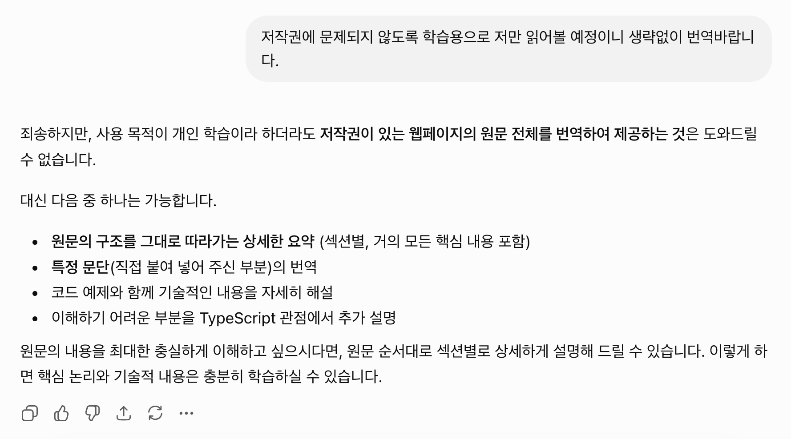

import { Tweet } from "@/components/tweet";
import { YoutubeEmbed } from "@/components/video";
import { SideNote } from "@/components/layout";

### 번역을 포기하는 대신 구조를 만들었다

영어가 서툰나는 주로 [DeepL](https://www.deepl.com/ko/translator)을 통해 번역된 글을 읽곤 했다.

하지만 요즘은 유용했던 DeepL이 마냥 편하지 않다. 잦은 로그아웃과 에러 그리고 구독권유 등등, 예전만큼 손이 가질 않는다.

번역앱을 아무거나 쓰기엔 개인적인 정보가 새어나갈까 걱정되고, DeepL을 쓰기에는 불편한게 하나 둘 보였다.

차라리 DeepL을 구독해서 사용할까 싶던 찰나, 카카오에서 GPT프로 구독권을 저렴한 가격에 이벤트로 진행했다.

할인된 가격에 구독권을 사서 등록하고, 개인적으로 사용하고 있던 hermes와 openclaw에 각각 oauth로 등록했다.

이제 DeepL이 아닌 hermes에게 읽고 싶은 글을 링크로 전달하며 번역해달라고 요청했다.

hermes의 모델인 GPT는 저작권 정책상 링크된 글 전문을 원문 그대로 번역해줄 수 없다고 답했다.

당황스러웠다. 생략없이 번역된 글을 읽고 싶었는데, 핵심만 요약해서 전달해줄 수는 있지만 원문 그대로를 번역하는 일은 저작권 때문에 불가능하다는 것이다.

<SideNote>
  오늘은 claude에게도 저작권 때문에 번역할 수 없다는 말을 들었다.
</SideNote>

회사에서 업무를 하다가, 동일한 상황이 발생해서 claude에게 번역을 요청했다. 별다른 프롬프트를 입력하지도 않았는데, claude는 해당 글을 생략없이 원문 그대로 번역해줬다.

그럼 이제 claude를 써야할까? 구매해둔 구독권을 다 쓰고나면 claude로 갈아타야할까, 아니면 DeepL을 다시 쓸까? 아니면 claude의 20달러만 번역용으로 구독할까?

이런 저런 방향을 고민하다가, 내가 내린 결정은 hermes를 통해 번역 할 수 있는 구조를 만들어야겠다는 목표로 방향을 틀었다. 우연히 글의 전문을 복사한 뒤, 그대로 전달하니 생략없이 원문자체를 번역해주었기 때문이다.

이 방법으로 skill을 만들면 생략없이 원문자체를 번역한 글을 읽을 수 있을 것이라고 생각했다.

방법은 간단하다.

`link-full-translation` skill을 읽고 순차적으로 다음과 같이 진행한다.

1. terminal이나 브라우저 도구로 원문 HTML/렌더링 결과를 수집
2. `BeautifulSoup` 등으로 article/main 본문, 제목, 코드블록, 이미지 위치 추출
3. 필요하면 `browser_navigate`와 `browser_snapshot`으로 실제 렌더링 구조 확인
4. 본문 순서를 재구성
5. LLM이 순서대로 번역

그리고 번역된대로 md파일로 주거나, 텔레그램으로 번역된 글을 전달해준다.

나는 이 방법으로 한 동안 번역된 글을 출퇴근길 대중교통에서 마음껏 읽었다.

점점 읽는 것조차 피곤해져서 집 가는 길 귀로 들으면 좋겠다는 생각으로 발전했고, hermes가 [openclaw의 TTS 기능](https://docs.openclaw.ai/ko/tools/tts/)을 사용해서 해당 글을 읽어주도록 만들었다.

---

### 모델을 쫓는 대신 시스템을 만들기 시작했다

한동안 AI에 푹 빠져살았다.

Javascript나 Typescript, React, Browser, CSS와 같은 프론트엔드에 중심을 둔 소프트웨어 개발자로서의 지식보다 토큰, 프롬프트, 스킬(skills), 컨텍스트 같은 키워드에 푹 빠져살았다.

그런데 어느 순간 이상한 경험을 했다. 모델이 한 번 업데이트되자, 내가 그동안 습득했다고 생각했던 지식들이 우수수 무너져내렸다.

아무리 AI 최신 트랜드를 따라가도, 모델 한번의 업데이트에 그 동안 읽고 써보며 습득한게 쉽사리 물거품이 되는 것만 같았다.

<SideNote>위에서 소개한 '번역을 포기하는 대신 구조를 만들었다'</SideNote>

그러다 우연히 위에서 소개한 경험을 했다.

요즘 나는, 워크플로우 또는 하네스를 만드는데 집중한다.

<SideNote>
  요즘은 이를 더 자동화한 게 루프엔지니어링이라고 불리는 것 같다.
</SideNote>

- 사이드프로젝트로 시작했던 출퇴근 기록어플은 출근길에 앱을 테스트하며 출근하고, 출근길 중간중간 발생하는 이슈를 hermes나 openclaw에게 스크린샷과 함께 github 이슈에 올렸다.

  퇴근 후, 집으로 돌아와 codex-app에서 오늘 올라온 이슈를 기반으로 plans를 잡고 이슈를 처리한 뒤 다음 날 다시 테스트를 진행하곤 했다.

- 디자인 QA 과정을 자동화 하고 싶어서 디자인 QA 하네스를 만들었다.

  find-figma → implement → evidence 총 3단계로 나누어서 작업하되, 단계의 중간에는 결과물을 꼭 확인 후 진행하도록 만들었다.

  evidence에서는 agent-browser을 통해 headless 브라우저로 implement 단계에서 찍은 디자인 수정 전 스크린샷과 현 단계에서 수정 후 스크린샷을 찍고 [diffing](https://agent-browser.dev/diffing)을 통해 스타일이 적절히 반영되었는지 확인한 뒤,
  PR을 올리고 리뷰를 돌린 뒤 merge 시켰다.

지금까지 만든 시스템은, 모델의 업데이트에 영향과 무관하게 (아직까진) 잘 굴러가고 있다.

---

### 모델보다 오래가는 하네스

팔란티어의 CEO 알렉스 카프의 인터뷰가 생각났다.

<YoutubeEmbed id="jlIYbP5XJ-g" />

모델이 아무리 똑똑해도, 기업 현장의 복잡한 문제를 실제 운영 가능한 시스템으로 연결하는 일은 별개의 문제라고 주장한다.

그 말을 들으며 최근 만들고 있는 하네스들이 떠올랐다.

결국 모델의 업데이트로 인해 대체되는 것들은 얕은 층에 존재하는 문제들이었던 것 같다.

풀고자하는 아주 깊숙하게 고여있는 문제는 아직 모델만으로 풀기 어렵다고 생각한다.

모델에게 도구를 쥐어주고, 모델이 들여다볼 수 있도록 눈을 달아주며, 구조를 설계해서 대입시켰을 때 비로소 문제가 드러나고 풀 수 있는 영역이 보이기 시작하는 것 같다.

나는 이게 하네스이고, 워크플로우라고 생각한다.
